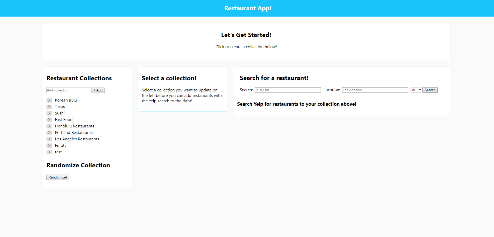
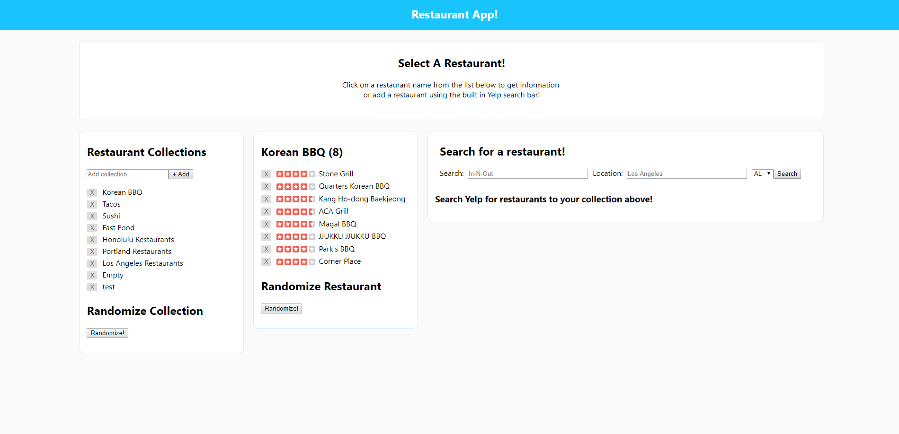
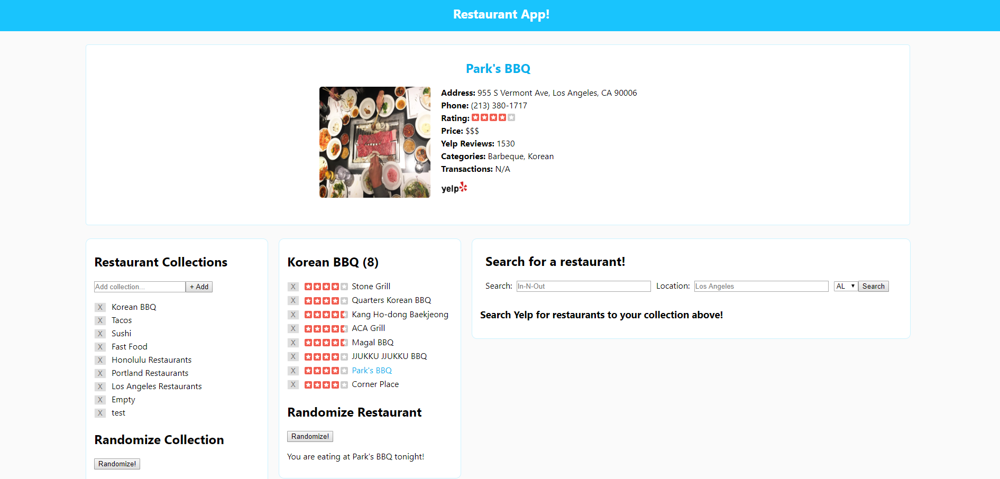
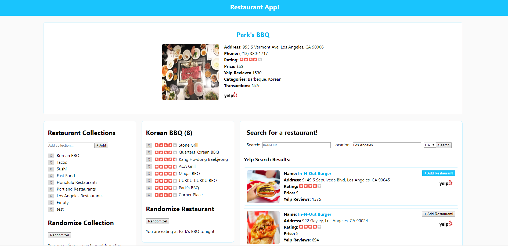
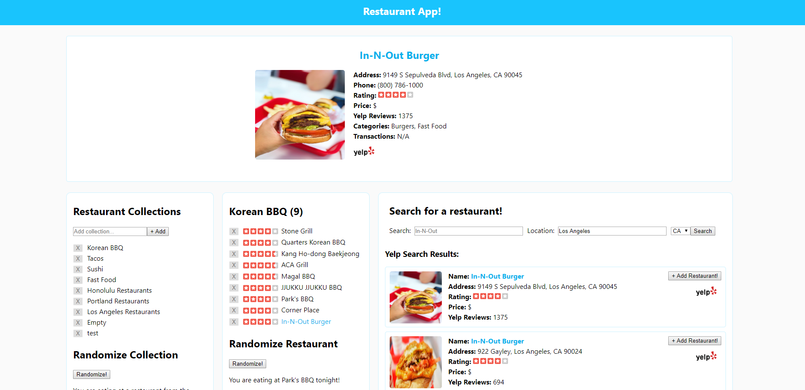
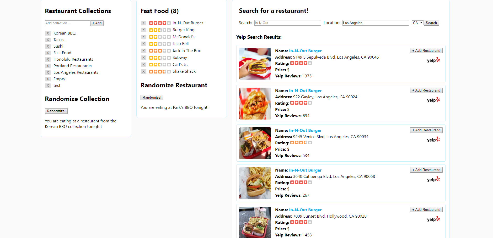

# Restaurant App

Ever have trouble deciding where to eat? The restaurant app makes deciding where to eat easy and exciting.
The Restaurant App allows users to create collections with restaurants that can be randomized at a click of a 
button. The randomize button randomly generates a suggested restaurant that you should eat at from your list 
of restaurants from your currently selected collection. Spend less time deciding and more time eating!

Not only does the app allow users to randomize a restaurant from a selected collection, you can also randomly
select the collection as well. For example, if you had collections named 'Italian', 'American', and 'Tacos', 
hitting the randomize collections button will randomly select a collection for you. Lets say the 'Tacos' collection
was randomly selected by our randomize function, the list of restaurants added to that collection will be listed
in the restaurants list section of the webpage. Users can then randomize a restaurant from the 'Tacos' collection
or manually select a restaurant to view details by clicking on the restaurants name. 

When a restaurant is clicked on, the restaurant details page will be loaded at the top of the page. The details
for the restaurant will be displayed using data from the Yelp Fusion database. The data being included at this 
time is address, phone number, Yelp rating, price ($ - $$$$), Yelp review count, Yelp categories, and transactions type.
Clicking on the restaurant title as well as any Yelp logos will link you directly to the Yelp page for the selected
restaurant.

The restaurant integrates the Yelp Fusion API to provide users with the ability to make search requests that return
restaurants from the Yelp Fusion Database. In the search for a restaurant section, enter any search term in the 
search field. For example you can search for terms as broad as 'food' or be as specific as searching for a restaurant
by name such as 'Howlin' Ray's'. After entering a search term, users are provided with the option of entering a city 
for location. The search will then make the request and return results based on the location you've provided. The
final search option is selecting the state in which you would like to search for restaurants. Select one of the fifty 
states from the dropdown box and click on search to submit your request!

After the search request is submitted, users will see a list of restaurants returned by the Yelp Fusion API. Each
result has restaurant details in addition to direct links to the restaurants Yelp page. A '+ Add Restaurant' button
is located at the top right of every restaurant result. Click on the '+ Add Restaurant' button to add the restaurant
to your currently selected Collection and the restaurant will be added to the bottom of your list.

- - - 

## Link to Restaurant App

https://thomas-restaurant-app-client.herokuapp.com/

- - - 

## Screenshots of Restaurant App

This first screen shot is the starting state of the Restaurant App with some preloaded collections. There are instructions listed for the user throughout the page (Let's get started, Select a collection!, Search for a restaurant!). At this stage, the user can add a collection with the name of their choosing, click on a collection to select it and have the lists of restaurants show up in the second column. The user can also submit a search to the Yelp Fusion database by entering search term, city and state before hitting the search button.

- - - 

This screen shot shows the list of restaurants that have been added to the 'Korean BBQ' collection by the user. The total number of restaurants in the colletion is listed within ( ) next to the collection name. Each restaurant in the collection is rendered with a delete button, Yelp rating, and restaurant name. The instructions at the top of the page have changed to assist users in selecting a restaurant. At this state, the user can click on the restaurant name or the 'randomize' button under the restaurants list to randomly select a restaurant to be displayed at the top of the page.

- - - 

This screen shot shows that the user has clicked on the restaurant name of 'Park's BBQ' which changes color on hover. As a result, the restaurant that is clicked on in the list is then displayed at the top of the page with all of the Yelp details or the page in addition to external links to the restaurants Yelp page that can be accessed by clicking on the restaurants title or Yelp logo.

- - - 

This screen shot shows the results of a user search. The user can provide a search term, search location (city) and select a state from the drop down menu. After submitting a search, the request is sent to the Yelp Fusion API and will return with up with five related results which are then available for the user to add to the currently selected collection. Add a restaurant to a collection by clicking on the '+ Add Restaurant' button at top right of each result. Once a restaurant is added, users can the click on the name and have the restaurant details be rendered at the top of the page.

- - - 

This screen shot is just a demostration of a user search for 'In-N-Out' in 'Los Angeles, CA'. The user then adds the restaurant to the 'Korean BBQ' collection and 'In-N-Out' is added to the bottom of the restaurants list. Upon user click of 'In-N-Out', the restaurants details are now rendered at the top of the screen. The details provided are restaurant name, address, phone, Yelp rating, price range, Yelp review count, categories, and transactions.

- - - 

This screenshot shows the returned results for the previous search for 'In-N-Out'. Five total results are rendered. In this screenshot the collection currently selected in 'Fast Food'.

- - -

## Tech Stack

* React for the frontend
* Redux for state management
* Node for the backend
* MongoDB or the database
* Enzyme, Chai, Mocha for testing

- - - 

## Code Description

The restaurant app is integrated with the Yelp Fusion API. For personal use, you need to place your unqiue Yelp Fusion API Key into a .env file.

- - -

This project was bootstrapped with [Create React App](https://github.com/facebook/create-react-app).

## Available Scripts

In the project directory, you can run:

### `npm start`

Runs the app in the development mode. 
Open [http://localhost:3000](http://localhost:3000) to view it in the browser.

The page will reload if you make edits. 
You will also see any lint errors in the console.

### `npm test`

Launches the test runner in the interactive watch mode. 
See the section about [running tests](https://facebook.github.io/create-react-app/docs/running-tests) for more information.

### `npm run build`

Builds the app for production to the `build` folder. 
It correctly bundles React in production mode and optimizes the build for the best performance.

The build is minified and the filenames include the hashes. 
Your app is ready to be deployed!

See the section about [deployment](https://facebook.github.io/create-react-app/docs/deployment) for more information.

### `npm run eject`

**Note: this is a one-way operation. Once you `eject`, you can’t go back!**

If you aren’t satisfied with the build tool and configuration choices, you can `eject` at any time. This command will remove the single build dependency from your project.

Instead, it will copy all the configuration files and the transitive dependencies (Webpack, Babel, ESLint, etc) right into your project so you have full control over them. All of the commands except `eject` will still work, but they will point to the copied scripts so you can tweak them. At this point you’re on your own.

You don’t have to ever use `eject`. The curated feature set is suitable for small and middle deployments, and you shouldn’t feel obligated to use this feature. However we understand that this tool wouldn’t be useful if you couldn’t customize it when you are ready for it.

## Learn More

You can learn more in the [Create React App documentation](https://facebook.github.io/create-react-app/docs/getting-started).

To learn React, check out the [React documentation](https://reactjs.org/).
